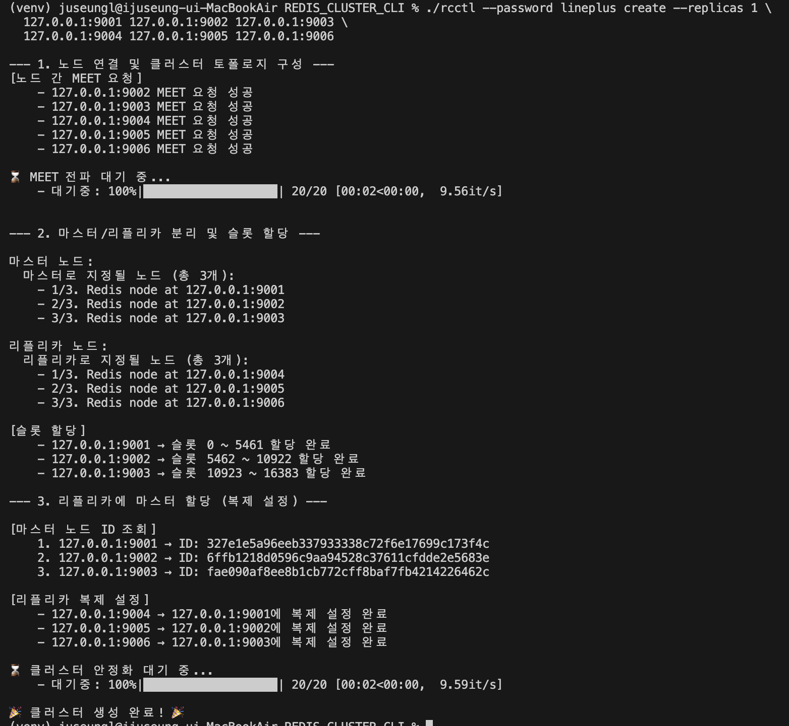
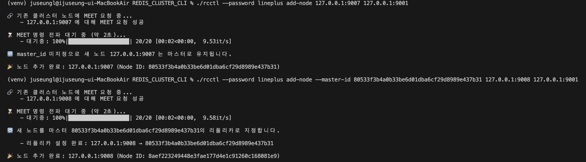
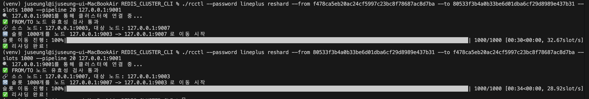
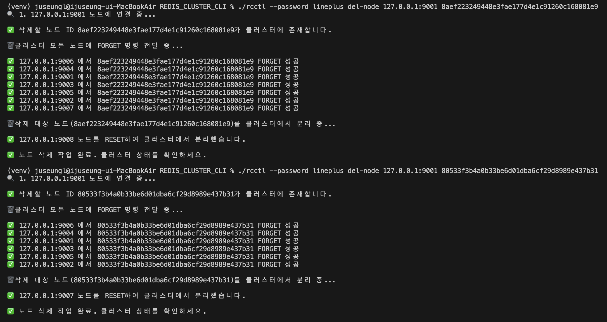
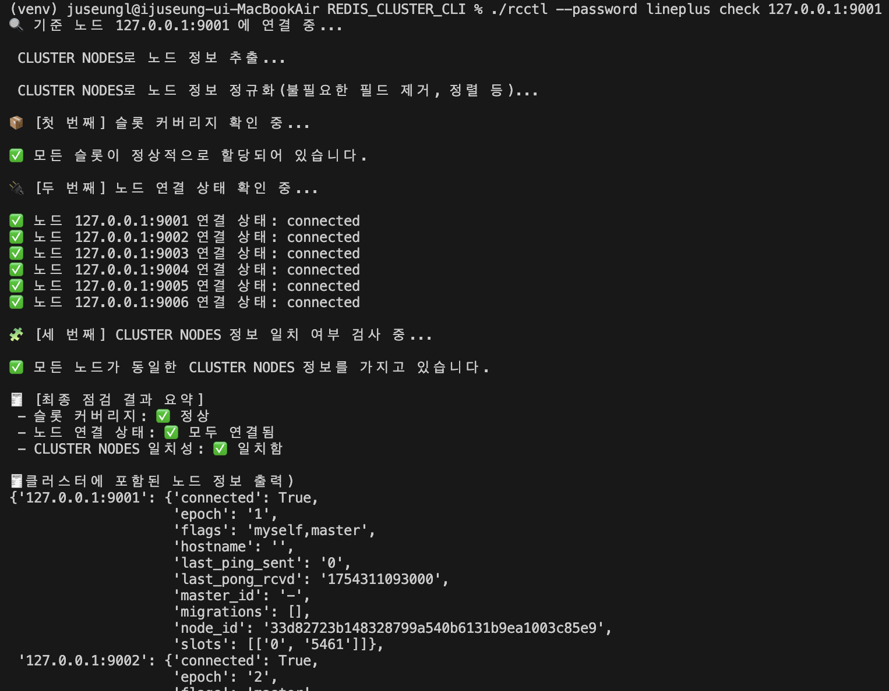
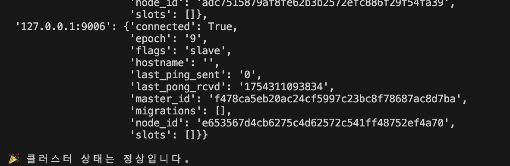
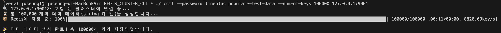

# Redis Cluster CLI

Python 기반 Redis Cluster 관리 CLI 도구입니다.  
클러스터 생성, 노드 추가/삭제, 슬롯 리샤딩, 테스트 데이터 삽입 등 다양한 기능을 제공합니다.
Redis Cluster Control 줄여서 rcctl

<br>

---

## 🔧 설치 및 실행

### 설치

```bash
# 레포에서 소스코드 다운
git clone https://github.com/juseungl/REDIS_CLUSTER_CLI.git
cd REDIS_CLUSTER_CLI
# 만약 logs 디렉토리가 root 디렉토리에 없다면
mkdir logs

# 가상환경 생성 및 활성화
python3 -m venv venv
source venv/bin/activate

deactivate venv

# 패키지 설치
pip install -r requirements.txt
```

### Redis 노드 실행
```bash
# 각 포트에 맞는 redis 설정파일을 기반으로 Redis 노드 실행
for port in {9001..9008}; do
  redis-server config/redis-${port}.conf &
done

# 정상적으로 켜졌는지 확인
ps aux | grep redis

# 종료 시
for port in {9001..9008}; do
  redis-cli -p ${port} -a lineplus shutdown
done
```
<br>

---

## 🧩 command 패키지 설명 (`command/`)

| 파일명                  | 설명                               |
|-------------------------|------------------------------------|
| `__init__.py`           | 패키지로 인식시키기 위한 초기화 파일 |
| `create.py`             | Redis 클러스터 초기 생성           |
| `add_node.py`           | 노드 추가 (마스터/슬레이브 지정 가능) |
| `del_node.py`           | 특정 노드를 클러스터에서 제거      |
| `reshard.py`            | 슬롯 리샤딩 수행 (슬롯 이동)       |
| `check.py`              | 클러스터 노드 상태 점검            |
| `populate_test_data.py` | 테스트용 key-value 데이터 대량 삽입 |


<br><br><br>

# rcctl : Redis Cluster Control Tool 사용법

Redis 노드 간 통신 중 네트워크 오류가 발생할 수 있으므로, 실패 시 해당 명령어를 다시 실행해 주세요. !!!

---

## help
사용법 안내를 출력합니다.
```bash
./rcctl help
```

<br>

***

<br>

## 1. Create
Redis 클러스터를 생성합니다.
```bash
# 형식
./rcctl --password <password> create [--replicas N] ip1:port1 ... ipN:portN

# 예시
./rcctl --password lineplus create --replicas 1 \
  127.0.0.1:9001 127.0.0.1:9002 127.0.0.1:9003 \
  127.0.0.1:9004 127.0.0.1:9005 127.0.0.1:9006
```


#### 1. 노드 연결 및 클러스터 토폴로지 구성
- 지정된 노드 리스트를 바탕으로 각 노드에 Redis 연결 생성
- 첫 번째 노드에 `CLUSTER MEET` 명령으로 나머지 노드들을 클러스터에 추가
- 모든 노드가 서로 인식하는 클러스터 토폴로지 형성

#### 2. 마스터/리플리카 역할 분리 및 슬롯 할당
- 전체 노드를 마스터 노드와 리플리카 노드로 분리
- Redis 클러스터의 총 16,384개 슬롯을 마스터 노드에 균등 할당
- 데이터 분산과 부하 균형을 위한 슬롯 분배

#### 3. 리플리카 복제 관계 설정
- 각 마스터 노드의 클러스터 ID 조회
- 리플리카 노드를 순환 방식으로 마스터에 연결하여 복제 관계 설정
- 장애 시 자동 페일오버를 위한 복제 구성

#### 4. 클러스터 안정화 대기
- 클러스터 상태가 완전히 안정화될 때까지 대기
- 초기 복제 동기화와 노드 간 상태 전파 완료

<br>

---

<br>

## 2. add-node
Redis 클러스터에 

```bash
# 형식
./rcctl --password <password> lineplus add-node [--master-id <str>] new_ip:new_port existing_ip:existing_port

# 예시
./rcctl --password lineplus add-node 127.0.0.1:9007 127.0.0.1:9001
./rcctl --password lineplus add-node --master-id 80533f3b4a0b33be6d01dba6cf29d8989e437b31 127.0.0.1:9008 127.0.0.1:9001
```


#### 1. 노드 연결 및 검증
- 새로 추가할 노드와 기존 클러스터 노드에 Redis 연결 생성
- 노드 주소 파싱 및 연결 상태 확인

#### 2. 클러스터 참여 (MEET)
- 기존 클러스터 노드에 `CLUSTER MEET` 명령 전송
- 새 노드를 클러스터 토폴로지에 추가
- 클러스터 내 노드 인식을 위한 전파 대기

#### 3. 역할 설정
- **마스터로 추가**: `--master-id` 옵션이 없는 경우 마스터 노드로 유지
- **리플리카로 추가**: `--master-id` 옵션이 있는 경우 `CLUSTER REPLICATE`로 해당 마스터의 리플리카로 설정

#### 4. 노드 ID 확인
- 새로 추가된 노드의 고유 클러스터 ID 조회 및 출력
- 추가 완료 메시지 표시

<br>

---

<br>

## 3. reshard
Redis 클러스터의 슬롯을 재분배합니다.

```bash
# 형식
./rcctl --password  <password> reshard --from  --to  --slots  [--pipeline ] access_node_ip:access_node_port
 
# 예시
./rcctl --password lineplus reshard --from f478ca5eb20ac24cf5997c23bc8f78687ac8d7ba --to 80533f3b4a0b33be6d01dba6cf29d8989e437b31 --slots 1000 --pipeline 20 127.0.0.1:9001
./rcctl --password lineplus reshard --from 80533f3b4a0b33be6d01dba6cf29d8989e437b31 --to f478ca5eb20ac24cf5997c23bc8f78687ac8d7ba --slots 1000 --pipeline 20 127.0.0.1:9001
```


#### 1. 노드 연결 및 검증
- 접근 노드를 통해 클러스터 연결 및 노드 정보 조회
- FROM/TO 노드 존재 여부 및 마스터 노드 여부 확인
- FROM 노드의 슬롯 보유 개수가 이동 요청 슬롯 수보다 큰지 검증

#### 2. 슬롯 이동 준비
- FROM 노드가 보유한 슬롯 목록 조회
- 이동할 슬롯 개수만큼 뒤에서부터 선택
- 소스 노드와 대상 노드에 각각 연결 생성

#### 3. 슬롯별 마이그레이션
- 각 슬롯에 대해 `CLUSTER SETSLOT IMPORTING/MIGRATING` 상태 설정
- 슬롯 내 모든 키를 파이프라인 단위로 `MIGRATE` 명령으로 이동
- 키 이동 완료 후 슬롯 소유권을 대상 노드로 변경

#### 4. 리샤딩 완료
- 모든 슬롯 이동 완료 시 진행 상황 표시
- 최종 완료 메시지 출력

<br>

---

<br>

## 4. del-node
Redis 클러스터에서 노드를 삭제합니다.
```bash
# 형식
./rcctl --password <password> del-node access_node_ip:access_node_port node_id_to_remove

# 예시
./rcctl --password lineplus del-node 127.0.0.1:9001 8aef223249448e3fae177d4e1c91260c168081e9
```



#### 1. 클러스터 연결 및 노드 검증
- 접근 노드를 통해 클러스터에 연결
- `CLUSTER NODES` 명령으로 클러스터 내 모든 노드 정보 조회
- 삭제할 노드 ID가 클러스터에 존재하는지 확인

#### 2. 종속성 검사
- 삭제 대상 노드가 마스터일 경우, 복제본(리플리카) 노드 존재 여부 확인
- 종속된 리플리카가 있으면 에러 메시지와 함께 작업 중단
- 리플리카 먼저 제거 또는 재구성 후 재시도 안내

#### 3. 클러스터에서 노드 제거
- 클러스터 내 모든 노드에 `CLUSTER FORGET` 명령 전파
- 각 노드에서 삭제 대상 노드에 대한 정보 삭제
- 실패한 노드가 있어도 계속 진행하며 경고 메시지 출력

#### 4. 대상 노드 분리
- 삭제 대상 노드에 `CLUSTER RESET` 명령 실행
- 노드를 클러스터에서 완전히 분리하여 독립 상태로 전환
- 분리 완료 또는 실패 메시지 출력

<br>

---

<br>

## 5. check
Redis 클러스터에서 노드를 삭제합니다.
```bash
# 형식
./rcctl --password <password> check ip:port

# 예시
 ./rcctl --password lineplus check 127.0.0.1:9001
```



#### 1. Redis 연결 및 클러스터 노드 정보 수집
- connect_base_node(): 기준 노드(ip:port)에 접속하여 Redis 객체 생성
- fetch_cluster_nodes(): 해당 노드에 CLUSTER NODES 명령어 실행 → 전체 클러스터 구성 정보 수집
- normalize_nodes(): 비교 및 점검에 적합하도록 각 노드 정보를 정규화 (불필요한 필드 제거, 형식 통일, 정렬 등)

#### 2. 슬롯 커버리지 점검
- 슬롯 0~16383번까지 모두 커버되고 있는지 확인
- 누락된 슬롯이 있다면 경고 출력
- 치명적인 문제로 고려는 X

#### 3. 노드 Connection 점검
- 각 노드의 connected 상태 확인
- 연결이 끊긴(disconnected) 노드가 있다면 알림 표시
- 장애 노드, 네트워크 문제 등을 미리 감지 가능


#### 4. 클러스터 내 모든 노드 간 CLUSTER_NODES 정보 일치 여부 확인
- 모든 노드에 직접 접속하여 CLUSTER NODES를 재실행
- 기준 노드의 정보(normalized_nodes)와 비교하여 일관성 여부 확인
- 불일치 시 정상으로 판단 X

#### 5. 최종 결과 출력

<br>

---

<br>

## 6. populate-test-data
Redis 클러스터에 테스트용 더미 데이터를 생성합니다.
```bash
# 형식
./rcctl --password <password> populate-test-data [--num-of-keys N] ip:port

# 예시
./rcctl --password lineplus populate-test-data --num-of-keys 100000 127.0.0.1:9001
```


#### 1. 키 개수 검증
- 입력된 키 개수가 1 이상 10,000,000 이하인지 검증 (요구사항 근거)
- default는 1000
- 범위를 벗어나면 프로그램 종료

#### 2. 클러스터 연결
- 지정된 노드 주소로 Redis Cluster에 연결

#### 3. 더미 데이터 생성
- `key:0000000001` ~ `key:{num_keys}` 형식의 키 생성
- `val:0000000001` ~ `val:{num_keys}` 형식의 값 생성

#### 4. 완료 확인
- 생성된 총 키 개수 및 범위 출력
- 저장 완료 메시지 표시